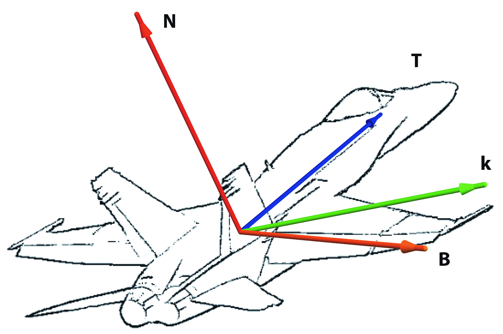
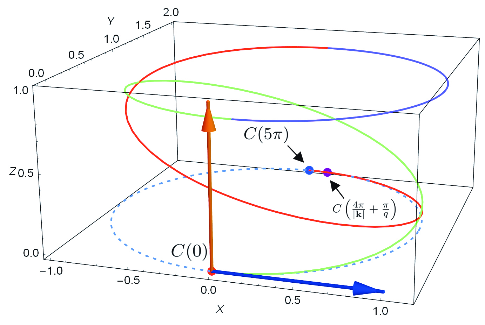

<head>
	<link rel="apple-touch-icon" sizes="180x180" href="/apple-touch-icon.png">
	<link rel="icon" type="image/png" sizes="32x32" href="/favicon-32x32.png">
	<link rel="icon" type="image/png" sizes="16x16" href="/favicon-16x16.png">
	<link rel="shortcut icon" type="image/x-icon" href="favicon.ico" />
	<link rel="manifest" href="/site.webmanifest">
	<link rel="mask-icon" href="/safari-pinned-tab.svg" color="#212262">
	<meta name="msapplication-TileColor" content="#da532c">
	<meta name="theme-color" content="#ffffff">
</head>

{::comment}

First level header
==================

### Test 2

## Test

# This is a placeholder.
{:/comment}

**Download:** [Mac](Kinematic Flight Simulation.zip) \| [Windows](Kinematic Flight Simulation_win.zip)

In the absence of gravity, is it possible for a fighter plane to out-turn an identical enemy plane by utilizing its ability to roll?

This project demonstrates one such heuristic which achieves this outcome.

Let $$\mathbf{N},\mathbf{B},\mathbf{T},\mathbf{k}$$ be the vectors shown in the diagram, with $$\mathbf{k} = p \mathbf{T} + q \mathbf{B}$$, where $$q$$ and $$p$$ denote the pitch and roll rates respectively.

{:refdef: style="text-align: center;"}
{:height="200px" width="301px"}
{: refdef}

We solve the following differential equation

$$
p\frac{d\mathbf{T}}{dt}  + q\frac{d\mathbf{B}}{dt} = 0
$$

to obtain

$$
\mathbf{T}(t)=\mathbf{k}\frac{\mathbf{k}\cdot \mathbf{T}(0)}{\mathbf{k}\cdot \mathbf{k}}+\left(\mathbf{T}(0)-\mathbf{k}\frac{\mathbf{k}\cdot \mathbf{T}(0)}{\mathbf{k}\cdot \mathbf{k}}\right)\cos\left(|\mathbf{k}|\,t\right)+\frac{\mathbf{k}}{|\mathbf{k}|}\times \mathbf{T}(0)\sin\left(|\mathbf{k}|\,t\right).
$$

This leads to the following heuristic for controlling the roll rate of the plane:

$$
  f_p (t) =
  \begin{cases}
                                   p & \text{if $0 \leq t < \frac{2\pi}{\left|\mathbf{k}\right|}$} \\
                                   0 & \text{if $\frac{2\pi}{\left|\mathbf{k}\right|} \leq  t< \frac{2\pi}{\left|\mathbf{k}\right|} +  \frac{\pi}{q}$} \\
                                    -p & \text{if $\frac{2\pi}{\left|\mathbf{k}\right|}  +  \frac{\pi}{q}\leq  t\leq\frac{4\pi}{\left|\mathbf{k}\right|} +  \frac{\pi}{q}$} \\
  \end{cases},
$$

where $$p$$ is a chosen constant.

The resulting trajectory is shown in the diagram

{:refdef: style="text-align: center;"}
{:height="300px" width="446px"}
{: refdef}

where $$C(t) = \left( \cos(t-\frac{\pi}{2}),\sin(t-\frac{\pi}{2})+1,0\right)$$ is a parameterization of the initial turn circle.

The following formula gives the angular difference that results from one iteration of our heuristic:

$$
A(p) = 4\pi\left(1-\sqrt{1-\frac{p^2}{q^2+p^2}}\right).
$$

For example, with $$p = 0.15$$, the angular difference is approximately $$8.02^{\circ}.$$ This is shown in the video below.

<figure class="video_container">
  <iframe src="https://www.youtube.com/embed/yljpfUZ9SLk" frameborder="0" allowfullscreen="true"> </iframe>
</figure>
